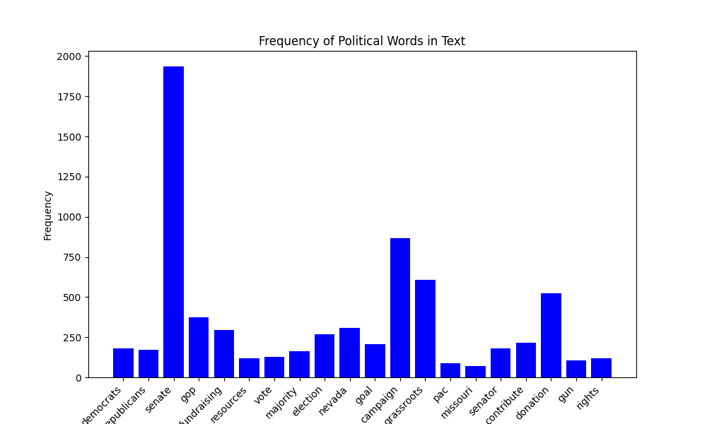
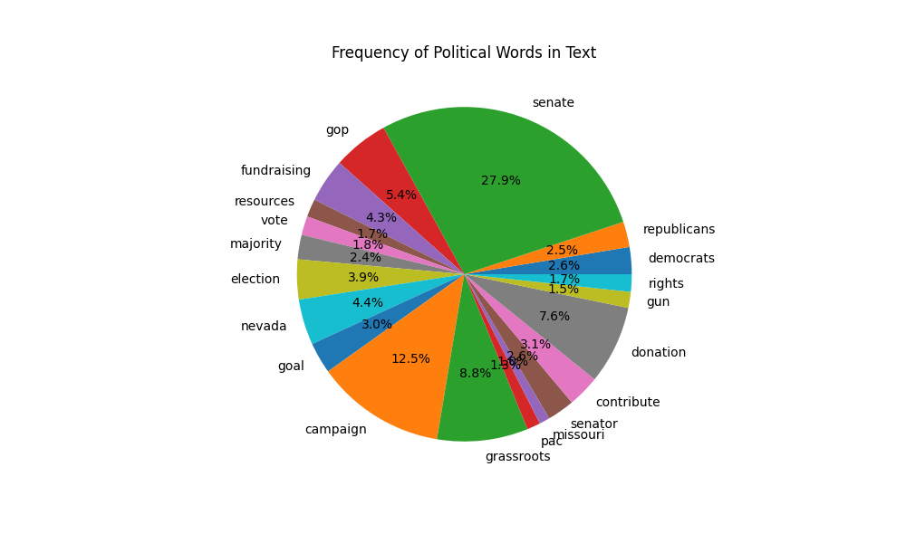
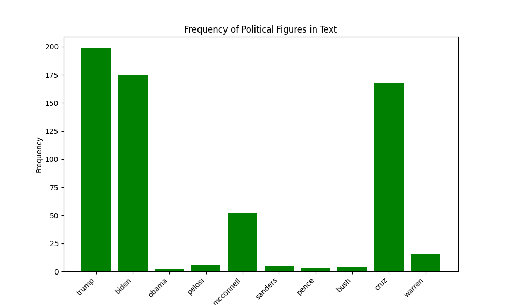
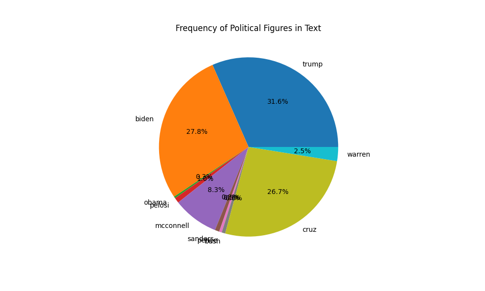
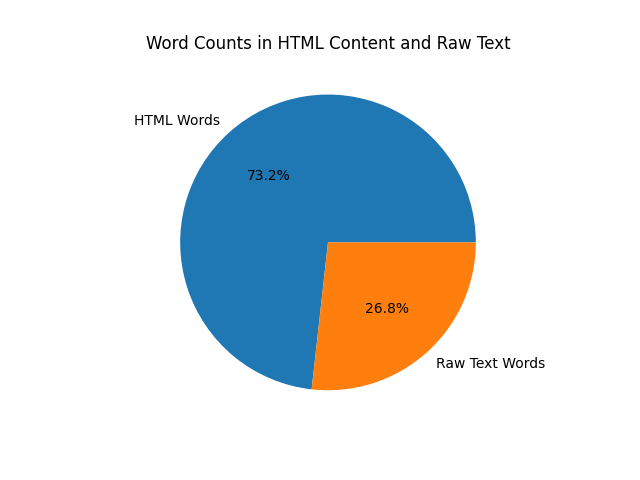
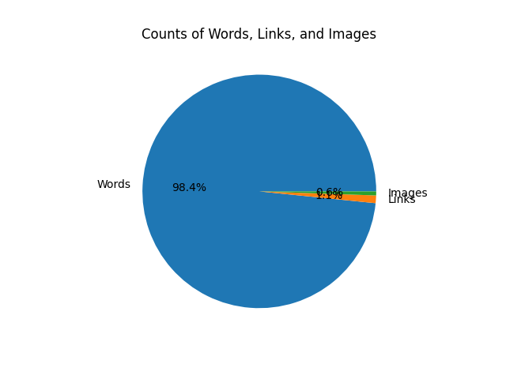

# Collect and Pre-process the Data: 
The data is collected from an mbox file which contains emails. The Python mailbox library is used to read the mbox file. Each email is processed to extract details such as 'From', 'Delivered-To', 'Subject', 'Date', 'Labels', and the content of the email in both plain text and HTML formats. The subject line is decoded from the "Quoted-Printable" format to a readable format using the email.header's decode_header function. The processed emails are then saved as a JSON file.
# preliminary analysis of the data: 
The analysis involves counting the frequency of certain political words and figures in the email content. The words and figures are predefined in lists. The email content is tokenized and the frequency of each word or figure is counted. The results are visualized using bar plots and pie charts.  The analysis also includes counting the number of words, links, and images in the HTML content and raw text of the emails. The counts are visualized using a pie chart.
# Question we can answer: 
* Content Analysis: The code can identify the frequency of certain political words or figures in the email content.

* Email Content Extraction: The code can extract and process content (especially HTML content) from emails.
* Content Quantification: The code can count the number of words, links, and images in the HTML content and raw text of the emails.

# Questions we can't answer: 
* Contextual Analysis(for now): Understanding the context or sentiment of the mentions (positive, negative, neutral) might require more sophisticated NLP techniques not evident in the initial code overview.
* Advanced Text Analysis(for now): The code does not perform advanced text analysis techniques such as topic modeling, sentiment analysis, or named entity recognition.