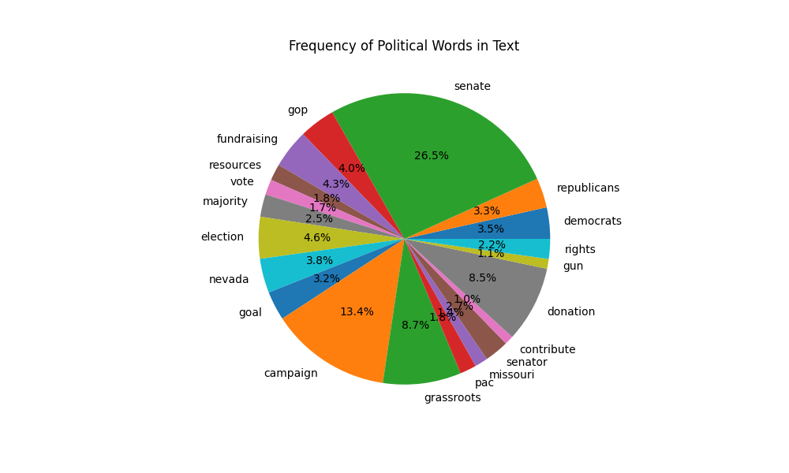
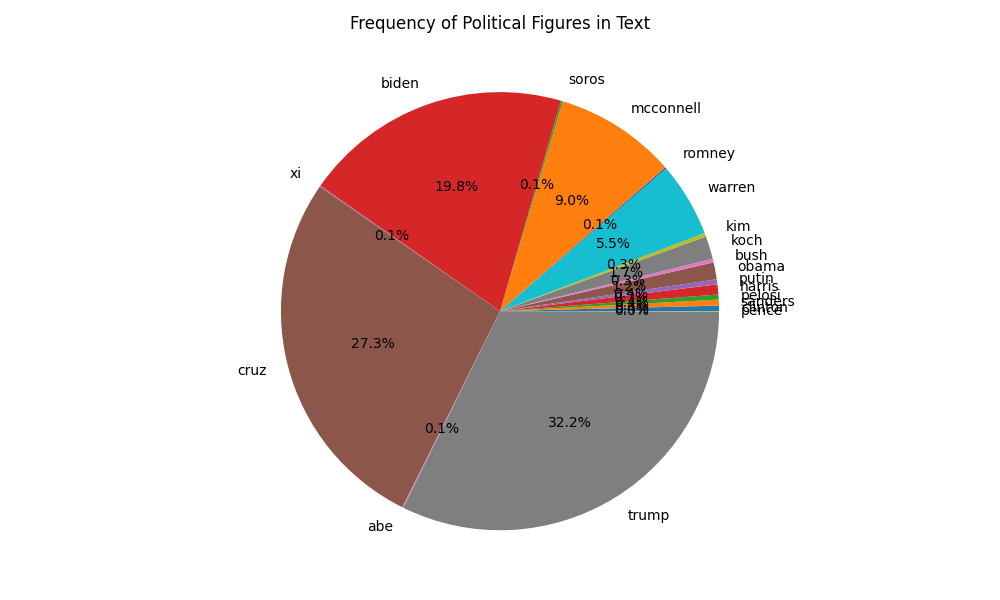

# Election Narratives: Early Insight

During the establishment of contact with teammates and clients, we conducted preliminary extraction and analysis of the data. We manually retrieved all emails up to February 1st through Google’s interface, extracted the text, and displayed keywords, key figures, and information density. 

### Data Collection and Pre-processing 

The data is collected from an mbox file which contains emails. The Python mailbox library is used to read the mbox file. Each email is processed to extract details such as 'From', 'Delivered-To', 'Subject', 'Date', 'Labels', and the content of the email in both plain text and HTML formats. The subject line is decoded from the "Quoted-Printable" format to a readable format using the email.header's decode_header function. The processed emails are then saved as a JSON file.

### Preliminary Analysis 

The analysis involves counting the frequency of certain political words and figures in the email content. The words and figures are predefined in lists based on our political knowledge, and they are shown below. 
```python
political_words = ['democrats', 'republicans', 'senate', 'gop', 'fundraising', 'resources', 'vote', 'majority', 'election', 'nevada',  'goal', 'campaign', 'grassroots', 'pac', 'missouri', 'senator', 'contribute', 'donation', 'gun', 'rights']

political_figures = ['trump', 'biden', 'obama', 'clinton', 'pelosi', 'mcconnell', 'sanders', 'harris', 'pence', 'romney', 'bush', 'cruz', 'warren', 'soros', 'koch', 'soros', 'koch', 'putin', 'xi', 'kim', 'merkel', 'macron', 'trudeau', 'modi', 'abe', 'erdogan']
```
The email content is tokenized, and the frequency of each word or figure is counted. The results are visualized using bar plots and pie charts. The analysis also includes counting the number of words, links, and images in the HTML content and raw text of the emails. The counts are visualized using a pie chart. 

### Findings 

With email content extraction and quantification, we can visualize some intuitive results. 

- Frequent political words



The pie chart and bar chart present data on the frequency of specific political words within a text. The pie chart indicates that the term 'senate' is the most prevalent, accounting for 27.9% of occurrences, followed by 'gop' and 'campaign', which also appear to be significant aspects. Words related to political activities and structures such as 'fundraising', 'vote', 'election', and 'majority' also feature prominently. The bar chart corroborates this, showing 'senate' as the term with the highest frequency, significantly more than others. The next most frequent term is 'gop', followed by 'campaign'. The data suggest a strong focus on the legislative aspect of politics ('senate', 'vote', 'majority') and the workings of the political process ('campaign', 'fundraising'). Furthermore, the terms ‘Republicans’ and ‘Democrats' are frequently mentioned, indicating that discussions in the text are possibly centered around these two main political parties. Other terms such as 'goal', 'grassroots', 'pac', 'senator', 'contribute', 'donation', 'gun', and 'rights' indicate various political concerns and activities within the narratives.

- Frequent polictial figures



The charts depict the frequency of reference to various political figures in the emails. The bar chart shows that Trump is the most frequently mentioned, followed by Biden and Obama. There is a significant drop in the remaining figures, such as Pelosi, McConnell, Sanders, Pence, Bush, Cruz, and Warren. The pie chart confirms the dominance of Trump and Biden in the conversation, collectively accounting for over 59% of all mentions. Obama holds a substantial share as well, with around 27.8%. Other figures have significantly smaller shares, suggesting that the election narratives are heavily concentrated around the top figures.

- Information proportion\


The pie chart details the proportions of words, links, and images in a dataset. Words overwhelmingly dominate the content, comprising 97.9% of the elements counted. Links and images are a minor part of the content, with links slightly more prevalent at 1.2% compared to images at 0.9%. This indicates a text-heavy composition with relatively few multimedia elements or hyperlinks. 

### Goals

We have now gained a complete picture of the data, and the next step will be to refine our analysis according to specific requirements. We will carry out statistics separately by party and state and introduce more background information about politics, hoping to gain insights into misinformation and the intensity of competition. We will likely need some interdisciplinary knowledge, and we may also introduce large language models.
